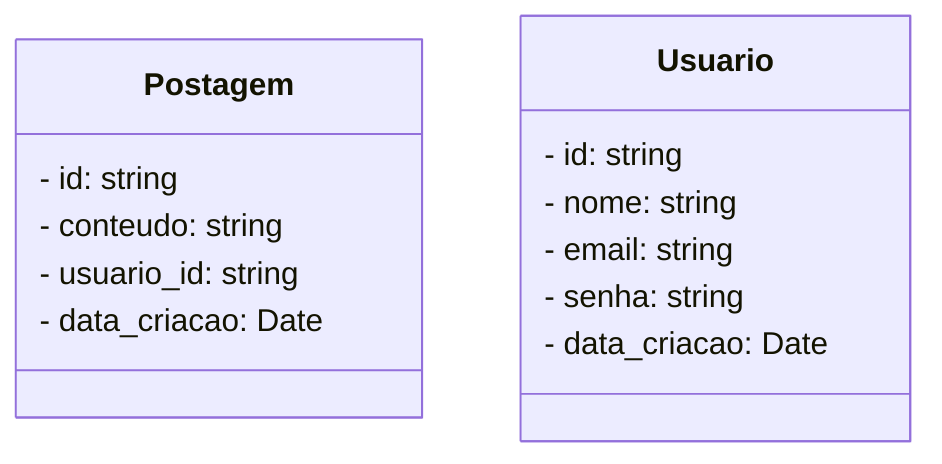

# Rede Social - Cassandra Database

<br />

<div align="center">
     
    <br /><b>com</b><br />
     
</div>


<br />

Este projeto é um **Mínimo Produto Viável (MVP)** de uma API para uma rede social, desenvolvido com **NestJS** e utilizando o banco de dados não relacional baseado em colunas **Cassandra**. A API implementa as operações fundamentais de um CRUD para gerenciamento de **usuários** e **postagens**, oferecendo funcionalidades básicas para criação, leitura, atualização e exclusão de dados.

<br />

## Tecnologias

- **NestJS**: Framework para construção de APIs em Node.js.
- **Cassandra**: Banco de dados NoSQL para armazenar os dados dos usuários e postagens. 
- **TypeScript**: Linguagem de programação para garantir tipagem estática.
- **Docker (opcional)**: Para facilitar a configuração do ambiente de desenvolvimento. 

<br />

## Funcionalidades

- **Entidade `Usuario`**:  
	- Cadastro de usuários. 
	- Listagem de usuários. 
- **Entidade `Postagem`**: 
	- Criação de postagens. 
	- Listagem de postagens de um usuário específico.
	- Exclusão de postagens.

<br />

## Diagrama de Classes



<br />

## Requisitos 

- Node.js (>= 16.x)
- Docker (para executar o Cassandra)
- Cassandra (via Docker ou serviço local)

<br />

## Instalação 

1. Clone o repositório:    

```bash
git clone https://github.com/rafaelqa80/redesocial_cassandra.git
```

2. Instale as dependências:

```bash
cd redesocial_cassandra
npm install
```

3. Inicialize o Banco de dados Cassandra. 

> [!TIP]
>
> No final do README tem um passo a passo de como instalar o Banco de dados Cassandra no Windows e como executar via Docker.

4. Crie a Keyspace **rede_social** e as Famílias de colunas **usuario** e **postagem**, através do código abaixo:

- Execute no Terminal do WSL2 o comando abaixo para conectar com o Cassandra:

```bash
cqlsh
```

- Execute o código abaixo no Terminal, dentro do **cqlsh**, para criar o Keyspace e as Famílias de colunas:

```cassandra
CREATE KEYSPACE rede_social WITH replication = {'class': 'SimpleStrategy', 'replication_factor': 1};

USE rede_social;

CREATE TABLE usuario (
  id UUID PRIMARY KEY,
  nome TEXT,
  email TEXT,
  senha TEXT,
  data_criacao TIMESTAMP
);

CREATE TABLE postagem (
  id UUID PRIMARY KEY,
  usuario_id UUID,
  conteudo TEXT,
  data_criacao TIMESTAMP
);

```

<br />

> [!IMPORTANT]
>
> **Enquanto você estiver executando a aplicação, o WSL2 rodando Ubuntu deve permanecer aberto e conectado, como mostra a imagem abaixo:**
>
> <div align="center">
>      
> </div>

<br />

## Bibliotecas do NestJS

- [x] @nestjs/common 
- [x] @nestjs/core 
- [x] @nestjs/platform-express 
- [x] cassandra-driver
- [x] reflect-metadata
- [x] rxjs
- [x] uuid

<br />

------

<br />

## 👉 Instalação do Cassandra no Windows:

1. Instale ou habilite o **WSL2**

2. Instale o **Ubuntu** dentro do WSL2

3. Atualize o Ubuntu:

```bash
sudo apt update
sudo apt upgrade -y
```

4. Instale o Java 17:

  ```bash
sudo apt install openjdk-17-jdk curl gnupg -y
  ```

5. Adicione o repositório do Apache Cassandra e a chave GPG no Ubuntu:

  ```bash
curl https://downloads.apache.org/cassandra/KEYS | sudo gpg --dearmor -o /usr/share/keyrings/cassandra-archive-keyring.gpg
  ```

6. Adicione o repositório do Apache Cassandra na lista de fontes do seu sistema Ubuntu:

  ```bash
echo "deb [signed-by=/usr/share/keyrings/cassandra-archive-keyring.gpg] https://downloads.apache.org/cassandra/debian $(lsb_release -cs) main" | sudo tee /etc/apt/sources.list.d/cassandra.list
  ```

7. Instale o Apache Cassandra

```bash
sudo apt update
sudo apt install cassandra -y
```

8. Inicialize o serviço do Apache Cassandra

```bash
sudo systemctl start cassandra
```

9. Verifique o Status do Serviço

```bash
sudo systemctl status cassandra
```

10. Adicione o Apache Cassandra na inicialização do Ubuntu

```bash
sudo systemctl enable cassandra
```

11. A porta de conexão do Cassandra deve ser a **9042**.

<br />

## 👉 Executar o Cassandra via Docker:

1. Instale o Docker (https://www.docker.com/)
2. Execute o comando abaixo no Terminal, para subir uma imagem Docker do Cassandra

```bash
docker run --name cassandra -p 9042:9042 -d cassandra:latest
```

3. A porta de conexão do Cassandra deve ser a **9042**.
